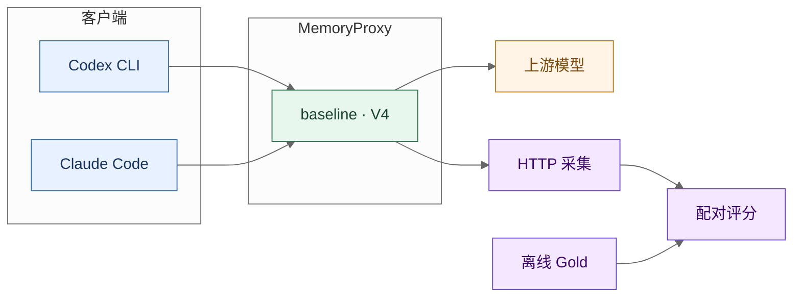

<h1 align="center">TencentDB Agent Memory</h1>

<p align="center"><strong>任务一提交 · Proxy 系统提示词注入优化</strong></p>
<p align="center">减少冗余描述，按信息缺口决定工具调用。</p>

<p align="center">
  <a href="docs/task1-report/TASK1-FINAL-REPORT.zh-CN.md">任务报告</a> ·
  <a href="scripts/README.md">运行脚本</a>
  <br>
  <a href="#快速开始">快速开始</a> ·
  <a href="#工作原理">工作原理</a> ·
  <a href="#评测与数据">评测与数据</a> ·
  <a href="#源码导航">源码导航</a>
</p>

---

本仓库是 TencentDB Agent Memory **任务一**提交：交付 final 注入实现，并保留 baseline 对照、test1k 数据与双终端评测。目标是在需要时调用 Memory、Skill 或 Knowledge，在信息充分的编码任务中保持不调用。

## 三项贡献

<table>
<tr>
<th align="left" width="33%">方法</th>
<th align="left" width="33%">数据</th>
<th align="left" width="33%">评测</th>
</tr>
<tr valign="top">
<td>

- 共享协议与应调用 / 不应调用边界
- 契约生成工具卡，只保留差异
- 能力筛选；绑定与资产后置

</td>
<td>

- 公开仓库语境上的受控构造
- 同 Query 的应调用 / 不应调用 Pair
- 同主题干扰与普通编码负例
- Gold 绑定目录与合法调用链

</td>
<td>

- Codex / Claude Code 双客户端
- baseline 与 V4 独立源码对照
- HTTP 采集与全程调用链评分
- 离线复算，Gold 不进在线请求

</td>
</tr>
</table>



## 快速开始

老师首次拉取后的最终集评测请直接使用 [test1k 启动指南](scripts/QUICK-EVALUATION.zh-CN.md)：安装依赖，运行 `evaluate-test1k.ps1 -Mode prepare`，填写本地模型配置，再运行 `initialize` 和 `execute`。默认选择最终 1140 条数据；外部源码包解压到仓库根目录。

推荐 Node.js 24.x、npm、Git 和 PowerShell 7。在仓库根目录安装评测依赖，运行不调用真实模型的脚本检查：

```powershell
npm --prefix evaluation/MemoryProxy ci

node --test `
  scripts/audit-final5-input.test.mjs `
  scripts/final5-static-input.test.mjs `
  scripts/summarize-final5-complete.test.mjs
```

> [!NOTE]
> 这是本地校验，不是正式模型评测。真实运行见 [scripts/README.md](scripts/README.md)。

<details>
<summary><strong>更多本地检查：数据、评分与 V4 注入</strong></summary>

test1k 数据校验另需 Python 3。以下命令仍从仓库根目录执行：

```powershell
python evaluation/MemoryProxy/eval/tool-prompt-bench/formal-dataset/final5/test1k/validate_test1k.py
```

采集与评分测试需要显式选择 `measurement-v2` 的 Vitest 配置：

```powershell
npm --prefix evaluation/MemoryProxy test -- `
  --config eval/tool-prompt-bench/measurement-v2/vitest.config.ts `
  final5-metrics-report final5-capture-pipeline final5-full-episode
```

V4 的提示词编译、缓存边界与最终请求测试：

```powershell
npm --prefix implementations/final/MemoryProxy ci
npm --prefix implementations/final/MemoryProxy test -- `
  src/__tests__/tool-prompt-direct.test.ts `
  src/__tests__/tool-prompt-cache-listing.test.ts `
  src/__tests__/tool-prompt-hook-cache.test.ts `
  src/__tests__/tool-prompt-final-request.test.ts
```

这些检查不能代替模型实验。双客户端包装脚本还要求 Node.js 支持 `--use-env-proxy`。

</details>

## 工作原理

基线分别生成记忆工具、使用规则、L3 画像与 L2 索引、Skill 工具与列表、Knowledge 工具等注入块。V4 保留这些入口，在其后统一编译和布局：

1. **注册与筛选。** 根据配置及会话能力确定可见工具，区分 Memory、Skill、Knowledge，以及写入、提取等能力。
2. **编译工具卡片。** 生成 `when`、`path`、必要参数及适用的 `avoid`、`contrast` 字段，省略共享默认值已经表达的内容。
3. **组装注入区域。** 先放公共协议、调用边界与静态说明，再放运行时绑定和资产。
4. **写入最终请求。** 流水线把相关注入块合并为 `<task1_prompt_injection>`，统一追加到 system 消息。

<details>
<summary><strong>注入顺序</strong></summary>

内部顺序由 [`assembleFidelityInjectionRegion()`](implementations/final/MemoryProxy/src/injection/tool-prompt/prompt-layout.ts) 决定：

| 顺序 | 区域 | 内容 |
| ---: | --- | --- |
| 1 | 静态前缀 | 共享协议 |
| 2 | 静态前缀 | 应调用 / 不应调用 |
| 3 | 静态前缀 | 能力位图 |
| 4 | 静态前缀 | Memory、Skill、Knowledge 工具卡 |
| 5 | 静态前缀 | 静态使用指南 |
| 6 | 动态后缀 | 运行时绑定：地址与身份请求头 |
| 7 | 动态后缀 | 运行时资产：Skill 列表、Knowledge、L3 画像与 L2 索引 |

这套布局把动态内容放到后部，不表示修改提示词后仍能复用旧版本缓存，也不保证供应商的实际缓存命中率。

V4 当前只接受 `v4-compact`。评测中的 `server_team` 与 `V4` 来自两份独立源码目录，不是在 final 服务上切换出一个基线。

</details>

## 评测与数据

两个客户端分别使用 Codex CLI 和 Claude Code。每个客户端内先运行 `server_team`，再运行 `V4`，共用同一组 Case、Gold、Skill catalog 和评分逻辑，结果按客户端分别统计。

有效调用率、工具选择正确率越高越好；误调用率、工具说明注入 Token 越低越好。完整链成功率、严格链成功率和过度调用率作为整体调用效果的补充。

| 指标 | 方向 |
| --- | :---: |
| 有效调用率（ECR） | 提高 ↑ |
| 误调用率（FCR_all） | 降低 ↓ |
| 工具选择正确率（调用后选对，TSR_cond） | 提高 ↑ |
| 注入 Token 量（工具说明，T_desc） | 降低 ↓ |

<details>
<summary><strong>指标定义</strong></summary>

- **有效调用率（ECR）**：应调用样本中，实际触发工具调用尝试的比例。
- **误调用率（FCR_all）**：不应调用样本中，出现工具调用尝试的比例。
- **工具选择正确率（TSR_cond）**：已触发调用的应调用样本中，首个工具选对的比例。补充报告全样本首工具正确率（TSR_all），将漏调用保留在分母。
- **注入 Token 量（T_desc）**：从首个任务请求提取完整工具说明后的统一 Token 计量；计量脚本字段名为 `T_static`。Skill 条目正文单独统计，不以整段任务的 provider 输入替代。

完整口径见[任务报告附录 B](docs/task1-report/TASK1-FINAL-REPORT.zh-CN.md#附录-b-指标口径)和[评测说明](evaluation/MemoryProxy/eval/tool-prompt-bench/README.md#指标口径)。

</details>

### 数据集

| 数据集 | Team 数 | Case 数 |
| --- | ---: | ---: |
| [test1k](evaluation/MemoryProxy/eval/tool-prompt-bench/formal-dataset/final5/test1k/README.md) | 39 | 1,140 |

目录名不代表本次运行实际选中的样本。作者数据、Skill catalog、campaign plan 与 workspace manifest 必须匹配，详见[评测说明](evaluation/MemoryProxy/eval/tool-prompt-bench/README.md)。

每个 Team 的 `data/` 包含 `assets.json`、`cases.jsonl`、`gold.jsonl`、`team.json` 和 `evidence.jsonl`。Case 是待评测任务，Gold 是期望调用行为。

## 源码导航

阅读 V4 从[注入流水线](implementations/final/MemoryProxy/src/injection/pipeline.ts)开始，再到[提示词编译器](implementations/final/MemoryProxy/src/injection/tool-prompt/compiler.ts)和[最终布局](implementations/final/MemoryProxy/src/injection/tool-prompt/prompt-layout.ts)。对照入口是 baseline 的[原始注入流水线](implementations/baseline/MemoryProxy/src/injection/pipeline.ts)。

<details>
<summary><strong>源码索引</strong></summary>

以下入口均位于 `implementations/final/MemoryProxy/src/injection/`。

| 层次 | 源码入口 |
| --- | --- |
| 注册与编排 | [index.ts](implementations/final/MemoryProxy/src/injection/index.ts) · [pipeline.ts](implementations/final/MemoryProxy/src/injection/pipeline.ts) |
| 记忆工具、规则、画像与索引 | [tdai-tools-injector.ts](implementations/final/MemoryProxy/src/injection/injectors/tdai-tools-injector.ts) · [tdai-profile-memory-injector.ts](implementations/final/MemoryProxy/src/injection/injectors/tdai-profile-memory-injector.ts) |
| Skill 工具与列表 | [skill-tools-injector.ts](implementations/final/MemoryProxy/src/injection/injectors/skill-tools-injector.ts) · [skill-injector.ts](implementations/final/MemoryProxy/src/injection/injectors/skill-injector.ts) |
| Knowledge 工具与资源 | [knowledge-tools-injector.ts](implementations/final/MemoryProxy/src/injection/injectors/knowledge-tools-injector.ts) |
| 工具契约与编译 | [runtime-contract.ts](implementations/final/MemoryProxy/src/injection/tool-prompt/runtime-contract.ts) · [compiler.ts](implementations/final/MemoryProxy/src/injection/tool-prompt/compiler.ts) |
| 共享默认值与卡片布局 | [readable-shared-defaults.ts](implementations/final/MemoryProxy/src/injection/tool-prompt/readable-shared-defaults.ts) · [prompt-layout.ts](implementations/final/MemoryProxy/src/injection/tool-prompt/prompt-layout.ts) |
| 能力筛选与缓存标识 | [capability-pruned.ts](implementations/final/MemoryProxy/src/injection/tool-prompt/capability-pruned.ts) · [profiles.ts](implementations/final/MemoryProxy/src/injection/tool-prompt/profiles.ts) |

</details>

## 相关文档

| 入口 | 内容 |
| --- | --- |
| [任务报告](docs/task1-report/TASK1-FINAL-REPORT.zh-CN.md) | 任务一提交报告 |
| [评测工作区](evaluation/README.md) | 共用运行器、采集与评分 |
| [运行指南](scripts/README.md) | 脚本索引与操作细节 |

<details>
<summary><strong>版本来源</strong></summary>

导入来源见 [SERVICE-VARIANTS.md](evaluation/MemoryProxy/eval/tool-prompt-bench/SERVICE-VARIANTS.md)：

- baseline：`97f94654280b2932c35ba4806a491999ed244cc9`
- V4：`95339ab9137c04363969ee9c490f485f2b72ffb4`

实际运行以源码指纹为准，不能只凭 `server_team` 或 `V4` 标签认定版本一致。两份实现分别位于 `implementations/baseline/` 与 `implementations/final/`。

部署产品可阅读 [MemoryProxy 中文说明](implementations/final/MemoryProxy/README_CN.md)和[产品安装指南](implementations/final/INSTALL_CN.md)；复现本任务使用本仓库的评测入口。

</details>

## 运行边界

> [!IMPORTANT]
> 真实模型评测需要独立输入、资产导入与读回校验，再依次进行 `preview`、`check`、`execute`。`preview` 只展示配置与源码契约检查项，不代表运行时资产、工作区或服务已经就绪。

`runs/` 保存本地运行输出并被 Git 忽略。凭据、CLI Home、`.runtime/` 与未脱敏日志不应提交，也不应作为仓库展示内容。
