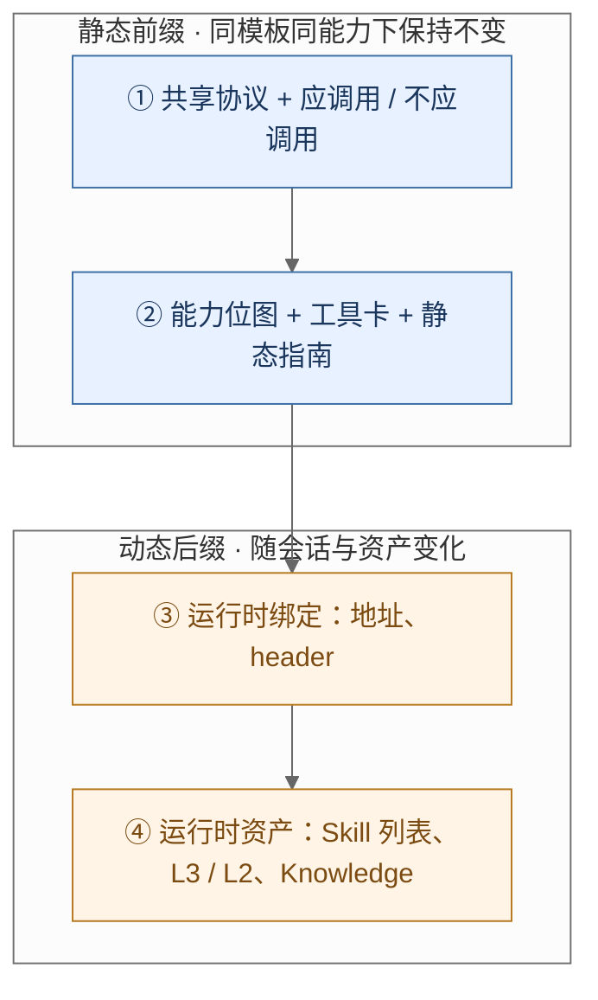

# 任务一完成报告：Proxy 系统提示词注入优化

> TencentDB Agent Memory **任务一提交**

**目录：** [摘要](#摘要) · [1. 任务要求](#1-任务要求) · [2. 完成路径](#2-完成路径) · [3. Final 实现](#3-final-实现) · [4. 任务核验](#4-任务核验) · [5. 完成效果](#5-完成效果) · [6. 交付](#6-交付)

**附录：** [A. 数据与来源](#附录-a-数据与来源) · [B. 指标口径](#附录-b-指标完整口径)

---

| 项目 | 内容 |
|---|---|
| 提交 | 任务一 · Proxy 系统提示词注入优化 |
| 交付 | final 注入实现（V4） |
| 对照 | baseline 原注入 |
| 核验终端 | Codex CLI × `gpt-5.6-luna`；Claude Code CLI × `glm-5.3-flash` |
| 核验数据 | test1k，39 个仓库，1,140 条 Case |

## 摘要

任务要求优化 MemoryProxy 注入给编码 Agent 的 Memory、Skill、Knowledge 工具说明：该调时打出真实 TDAI HTTP，不该调时保持不调用，选对工具并接上参数，同时把说明压短。

我们把这项工作做进 final 的 MemoryProxy 注入。baseline 按主题强制检索、三份协议各写一遍；final 改成信息缺口门控、一份共享 HTTP 协议、由运行时契约编译的工具卡，以及静态前缀 / 动态后缀的注入布局。各工具家族不再分别塞散文，只追加一块统一注入区。

核验用 test1k（1,140 条 Case、464 组同 Query 正负 Pair）和双终端真实 CLI。Codex（`gpt-5.6-luna`）误调用率 90.00% → 31.43%，调用后首工具正确率 27.36% → 56.14%，完整链 23.42% → 41.33%，说明压缩 29.65%。Claude Code（`glm-5.3-flash`）误调用率 64.60% → 16.28%，首工具 46.48% → 67.35%，完整链 37.33% → 54.72%，说明压缩 29.27%。应调用侧有效调用率保持 92.00% / 92.45%。

---

## 1. 任务要求

工具说明既要列出可执行入口，也要决定何时调用。四项目标：

| 目标 | 要求 |
|---|---|
| 应调会调 | 必要事实或工作流不在当前输入中时，发起真实 TDAI 调用 |
| 不该调则不调 | 普通编码、一般知识或上下文已充分时，不发起 TDAI 调用 |
| 选对工具 | 首次 TDAI 的家族、工具、端点、方法与操作正确，多步能接上参数 |
| 说明更短 | 完整工具说明更短，仍保留调用所需协议与参数 |

TDAI 以绑定到执行器的真实 HTTP 为准。本地读文件、代码搜索、口头写出工具名或 curl，均不计。

baseline 把主题相关写成必须动作，三个家族各写一遍协议：

| 位置 | 原句 | 问题 |
|:---|---|---|
| Memory | 「遇到用户问身份/历史/偏好/过往结论/项目约定时，必须先使用下面的 TDAI 记忆工具查询」 | 问到即先查，不判断对话、L3 或已有结果是否已经足够 |
| Skill | 「If a skill matches or is even partially relevant … MUST load … Err on the side of loading」 | 部分相关即强制加载 |
| 协议 | Memory、Skill、Knowledge 各写 curl、身份 header、错误处理 | 同一约束重复三遍 |

本任务改的是工具描述、触发规则和注入布局，记忆分层沿用：L0/L1 按需读取，L3 全文与 L2 索引直接注入。

---

## 2. 完成路径

主交付是 final 的注入实现。数据和双终端用来核验四项目标是否做完。

生成链：运行时契约 → 提示词中间表示 → 工具卡 → 统一注入区。各家族的说明先编译，再收成一块写入系统提示，不再按入口分别塞散文。

| 任务目标 | final 怎么做 |
|---|---|
| 应调会调 / 不该调则不调 | 全局 must-call / no-call / family-route 门控 |
| 选对工具、接上参数 | 单卡 when / contrast，多步 handoff |
| 说明更短 | 一份共享协议；卡上只留差异 |
| 会话变化时说明稳住 | 静态前缀 + 动态后缀；绑定与资产后置 |

---

## 3. Final 实现

### 3.1 信息缺口门控

baseline 缺少可执行的否定条件：正文已经在对话、L3 或工具结果里时仍会检索。final 把调用改成由缺口决定，用全局 must-call / no-call / family-route 写出。

应调用：启用的持久化资产能补上当前缺失的必要上下文时必须调用。

- Memory：取回当前对话与 L3 中没有的用户事实、偏好、既有决定、原话或场景正文。L2 路径或摘要不是场景正文。
- Skill：任务点名该 Skill，或确实依赖一项未给出的团队工作流。名称与描述不是正文。
- Knowledge：匹配跨文件结构或设计理由；当前精确代码以本地源码为准。

不应调用：自包含编码或一般知识；或所需事实已在当前对话、L3 或此前工具结果中。关键词重合单独不触发。

CALL 必须实际执行 HTTP 并检查响应；只输出工具名、path 或「准备调用」不等于执行。

家族按缺失证据的来源路由：决定、约定、原话走 Memory；可执行工作流和附件走 Skill；跨文件结构走 Knowledge。缺口仍在才换家族。

注入原文：

> CALL if enabled persistent assets supply missing required context
>
> NO_CALL for self-contained coding/general knowledge ... Keyword overlap alone never triggers a call.
>
> route by the missing evidence, not by a topic keyword.

单卡写出 when。记忆检索限定缺失的持久偏好、史实或既有决定，排除工作流与 Skill 资源；按名打开已知的当前 agent Skill。contrast 分流：原话走会话检索，目录内名称走按名查看，检索得到的 ID 走按 ID 查看。

### 3.2 共享协议与工具卡

baseline 三个家族各写 curl、header 和错误处理。final 只保留一份共享协议，工具卡只写相对这份协议的差异。

共享协议统一规定：用 Shell 执行 curl；POST JSON；endpoint 由家族基址加卡上路径组成；身份只走运行时绑定；成功为 HTTP 成功且返回码为 0；4xx 不重试、5xx 可一次。卡上省略的必选参数、衔接和恢复视为无。

工具卡按契约渲染，相对路径去掉家族前缀。身份参数不印在卡上，只走运行时绑定。

Memory 卡（`tdai_memory_search`）：

| | baseline | final |
|---|---|---|
| 触发 | 块首：「问身份/历史/偏好/约定必须先查」 | when：缺失的持久偏好、史实、既有决定；排除工作流 |
| 接口 | 完整 URL + body 示例 + returns 信封 | `path: /atomic/search`，`requires: query` |
| 相邻工具 | 块内散文区分 L0/L1/L2 | `contrast[tdai_conversation_search]`、`contrast[tdai_atomic_query]` |
| 协议 | 本块再写 curl、header、4xx/5xx | 使用共享协议 |

Skill 卡（`skill_view`）：

| | baseline | final |
|---|---|---|
| 触发 | 部分相关即 `skill_view`，宁可多加载 | when：按名打开已知的当前 agent Skill |
| 接口 | 完整 path、body、manifest 长段落 | `path: /get-by-name`，`requires: skill_name` |
| 相邻工具 | use 散文解释 search / view / files_read | contrast 到 `skill_view` / `skill_view_by_id`；附件卡 avoid 禁止猜 path |
| 协议 | Skill 块再写身份与错误码 | 同一份共享协议 |

### 3.3 契约、衔接与恢复

描述由契约生成，不由各家族手写。契约给出工具家族、路径、必选/可选/禁止参数和能力开关；中间表示叠加上 when、前驱、产出类型和一次恢复。模型只看到渲染后的卡。

多步可执行性写在衔接里：

| 下游工具 | 产物来源 | 绑定 |
|---|---|---|
| `skill_view_by_id` | `skill_search` | `data.items[].skill_id → skill_id` |
| `skill_files_read` | 已 view 的 manifest | 精确 `path` / `version`，禁止猜测 |
| `knowledge_tools_call` | `knowledge_tools_list` | `data.tools[].name → tool_name`，params 按 schema |

已有可靠名称、ID 或路径时允许直达。缺口补上就停止，不要求走完整条工具链。恢复是有限一次：坏 Skill ID 再搜索，坏路径再查看，空语义结果仅在已知过滤条件下改走精确查询。4xx 不重试，禁止猜测替换 ID 或路径。

卡上字段与契约核对；装配后静态前缀不泄漏服务地址，可见工具集与能力位图一致。

### 3.4 静态前缀与动态后缀

baseline 把会话 URL、Skill 列表、L3 与 L2 写进与工具说明同一区域，地址一变整段字节跟着变。final 把决策规则和工具卡放进静态前缀，把绑定和资产放到动态后缀。



能力位图按记忆、技能、知识及写操作等开关裁剪可见工具卡，未启用家族不出现。缓存身份区分模板版本、能力集合和会话资产。同一模板、同一能力下改服务地址或会话，静态前缀字节保持不变，前缀中不出现服务 URL。

---

## 4. 任务核验

用 test1k 和双终端真实 CLI 核验 final 是否把四项目标做完。Gold 不进模型输入，计分看绑定到执行器的 HTTP。

### 4.1 test1k

在 39 个真实仓库语境上资产先行构造 1,140 条 Case、464 组正负 Pair。公开对话只提供说法和仓库线索；调用标签、目标资产和合法链由本任务写出。缺口只落在 TDAI 资产里。

同一最终 Query、同一 `base_sha`、同一套资产，只改变 Context 是否已经给出缺口正文。样例 `DVG-T04-T01-C001` / `C002`：问预制体内部锁定名，正端 Context 不给名（Gold：`tdai_memory_search`），负端把 L1 正文贴进 Context（Gold：不调用）。完整原文见附录 A.5。

每条 Case 固定 8 个 Skill（本队 3 + next1 队 3 + next2 队 2），可搜索池为全部 240 个 Skill，用来卡 baseline「部分相关即加载」。Gold 按实际目录写链：在 8 条内则 `skill_view`，否则 `skill_search` → `skill_view_by_id`，答案在附件再 `skill_files_read`。

| 规模 | 数量 | 调用标签 | 数量 |
|---|---:|---|---:|
| Team / 仓库 | 39 / 39 | 应调用 / 不应调用 | 464 / 676 |
| Case | 1,140 | 正负 Pair | 464 |
| Skill / 带附件 | 240 / 39 | 上下文已给 / 干扰 / 普通编码 | 464 / 109 / 103 |

### 4.2 双终端跑 final

| 终端 | 模型 | 对照 |
|---|---|---|
| Codex CLI | `gpt-5.6-luna` | 同一模型上跑 baseline 与 final |
| Claude Code CLI | `glm-5.3-flash` | 同一模型上跑 baseline 与 final |

两侧服务独立部署、独立端口。每次尝试使用独立客户端目录，并把工作区切到该 Case 的代码基点。只有真正打到执行器的 HTTP 计为调用。Gold 离线对齐：首工具看家族、工具、端点、方法与操作；完整链还要参数和响应绑定（Skill ID 来自前一步返回，附件路径来自已查看的清单）。

### 4.3 怎么读表

| 指标 | 对应任务目标 | 计算 |
|---|---|---|
| 有效调用率 | 应调会调 | 正例中发生已绑定 TDAI 的比例 |
| 误调用率 | 不该调则不调 | 负例中发生已绑定 TDAI 的比例 |
| 工具选择正确率（调用后） | 选对工具 | 已触发正例中首工具选对的比例 |
| 完整链成功率 | 选对工具且接上参数 | 正例中走完合法链并绑上真实响应的比例 |
| 注入 Token / 压缩率 | 说明更短 | 首次任务请求中完整工具说明的 o200k_base Token；含共享协议，不含 Skill 正文 |

公式见附录 B。

---

## 5. 完成效果

Codex CLI × `gpt-5.6-luna`，基线 261 个有效 case，final 180 个；说明压缩用 162 个相同 case。

| 指标 | 统计范围 | 基线 | final | 变化 |
|---|---|---:|---:|---:|
| **有效调用率 ↑** | 应调用 case | 95.50%（106/111） | 92.00%（69/75） | ↓ 3.50 个百分点 |
| **误调用率 ↓** | 不应调用 case | 90.00%（135/150） | 31.43%（33/105） | ↓ 58.57 个百分点 |
| **工具选择正确率 ↑（调用后）** | 已触发调用的正例 | 27.36%（29/106） | 56.14%（32/57） | ↑ 28.78 个百分点 |
| **平均注入 Token ↓** | 本组全部有效 case | 3517.8 | 2475.5 | ↓ 1042.3 Token |
| 全样本首工具正确率 ↑ | 应调用 case | 26.13%（29/111） | 42.67%（32/75） | ↑ 16.54 个百分点 |
| 完整链成功率 ↑ | 应调用 case | 23.42%（26/111） | 41.33%（31/75） | ↑ 17.91 个百分点 |
| 严格链成功率 ↑ | 应调用 case | 15.32%（17/111） | 17.33%（13/75） | ↑ 2.02 个百分点 |
| 过度调用率 ↓ | 应调用 case | 80.18%（89/111） | 58.67%（44/75） | ↓ 21.51 个百分点 |
| 注入 Token 中位数 | 本组全部有效 case | 3517.0 | 2475.0 | ↓ 1042.0 Token |
| 注入 Token P95 | 本组全部有效 case | 3532.0 | 2481.0 | ↓ 1051.0 Token |

同 case 说明压缩：3518.6 → 2475.4 Token，压缩率 29.65%。

Claude Code CLI × `glm-5.3-flash`，基线 188 个有效 case，final 139 个；说明压缩用 125 个相同 case。

| 指标 | 统计范围 | 基线 | final | 变化 |
|---|---|---:|---:|---:|
| **有效调用率 ↑** | 应调用 case | 94.67%（71/75） | 92.45%（49/53） | ↓ 2.21 个百分点 |
| **误调用率 ↓** | 不应调用 case | 64.60%（73/113） | 16.28%（14/86） | ↓ 48.32 个百分点 |
| **工具选择正确率 ↑（调用后）** | 已触发调用的正例 | 46.48%（33/71） | 67.35%（33/49） | ↑ 20.87 个百分点 |
| **平均注入 Token ↓** | 本组全部有效 case | 3482.8 | 2463.8 | ↓ 1019.0 Token |
| 全样本首工具正确率 ↑ | 应调用 case | 44.00%（33/75） | 62.26%（33/53） | ↑ 18.26 个百分点 |
| 完整链成功率 ↑ | 应调用 case | 37.33%（28/75） | 54.72%（29/53） | ↑ 17.38 个百分点 |
| 严格链成功率 ↑ | 应调用 case | 25.33%（19/75） | 26.42%（14/53） | ↑ 1.08 个百分点 |
| 过度调用率 ↓ | 应调用 case | 69.33%（52/75） | 66.04%（35/53） | ↓ 3.30 个百分点 |
| 注入 Token 中位数 | 本组全部有效 case | 3484.0 | 2464.0 | ↓ 1020.0 Token |
| 注入 Token P95 | 本组全部有效 case | 3493.0 | 2467.0 | ↓ 1026.0 Token |

同 case 说明压缩：3483.1 → 2463.7 Token，压缩率 29.27%。

这些数字对应 final 里的三处改动：

- **缺口门控**把不该打的 HTTP 压下来。Codex 误调用率 −58.57 个百分点，Claude −48.32 个百分点；应调用侧有效调用率保持 92.00% / 92.45%。
- **契约化工具卡**把首工具和完整链抬上去。调用后首工具 +28.78 / +20.87 个百分点，完整链 +17.91 / +17.38 个百分点。Codex 过度调用率 80.18% → 58.67%。
- **共享协议**把说明压短约 29%。口径含共享协议和运行时绑定，不含 8 条 Skill 正文。

---

## 6. 交付

任务一的主交付是 final 的 MemoryProxy 注入实现，用 test1k 和双终端核验四项目标已经做成。入口与数据文件见附录。

| 目标 | 完成情况 |
|---|---|
| 应调会调 | 有效调用率保持 92.00% / 92.45% |
| 不该调则不调 | 误调用率 −58.57 / −48.32 个百分点 |
| 选对工具 | 调用后首工具 +28.78 / +20.87 个百分点；完整链 +17.91 / +17.38 个百分点 |
| 说明更短 | 工具说明压缩约 29% |

---

# 附录

Codex CLI × `gpt-5.6-luna`，Claude Code CLI × `glm-5.3-flash`。比例按「baseline / final」顺序，保留分子与分母。

**目录：** [A. 数据与来源](#附录-a-数据与来源) · [B. 指标口径](#附录-b-指标完整口径)

---

## 附录 A 数据与来源

### A.1 构造集规模

数量由 test1k `teams/*/data/` 中的 JSON / JSONL 统计。Gold 全部 `origin=pilot`。

| 项目 | test1k |
|:---|---:|
| Team 数 | 39 |
| 不同 `repo_id` | 39 |
| Case / Gold 行数 | 1,140 |
| 应调用 | 464 |
|  记忆 / 技能 / Knowledge | 241 / 223 / 0 |
| 不应调用 | 676 |
|  上下文已给 / 干扰 / 普通编码 | 464 / 109 / 103 |
| 正负 Pair | 464 |

另有：`repo` + `base_sha` 组合 201；Case 目录绑定 1,140、实际使用的不同目录 86；每条目录 8 个 Skill；同目录名称列表的 Pair 222，名称列表或顺序不同的 Pair 242。

路径：[test1k](../../evaluation/MemoryProxy/eval/tool-prompt-bench/formal-dataset/final5/test1k/teams)

### A.2 资产与链型

下表统计 test1k 作者资产数组。评测导入可保留全体 240 个可搜索 Skill 以形成邻队干扰。

| 资产 | 数量 |
|:---|---:|
| Memory 记录 | 293 |
| L0 记录 | 1 |
| L1 记录 | 292 |
| L2 记录 | 0 |
| Skill | 240 |
| 带 `files` 的 Skill | 39 |
| `files` 条目（含许可证文件） | 78 |
| Knowledge 资产条目 | 78 |

| Gold 调用链 | 数量 |
|:---|---:|
| `tdai_memory_search` | 241 |
| `tdai_read_scene` | 0 |
| `skill_view` | 66 |
| `skill_search` → `skill_view_by_id` | 118 |
| `skill_view` → `skill_files_read` | 31 |
| `skill_search` → `skill_view_by_id` → `skill_files_read` | 8 |
| 不调用 | 676 |

CALL 按链长：一步 307、两步 149、三步 8。Memory 正例走 L1 `tdai_memory_search`。

### A.3 来源三层与许可

1. **公开对话语境。** [NAIST-SE/DevGPT](https://github.com/NAIST-SE/DevGPT)，revision `685efd2509dede9a6e996b839ae4e20d33430648`，Zenodo `10086809` v9，CC-BY-4.0。提供任务说法，不提供调用标签。
2. **GitHub 仓库与 `base_sha`。** 可恢复的代码环境。各仓许可证独立适用。
3. **本任务编写的资产、Context 与 Gold。** test1k 的 1,140 条 Gold 全部 `origin=pilot`。Skill 附件自造，MIT-0。

evidence 中 `source_file=manual` 为 1,131 行。原始对话的当时答案、后续轮次、目标补丁与 Gold 不进入模型输入。

### A.4 数据文件职责

| 文件 | 职责 | 是否进入模型可见输入 |
|---|---|---|
| `team.json` | Team、仓库和资产身份 | 仅转换后的运行身份或必要语境 |
| `assets.json` | Memory、Skill、Knowledge 资产 | 按层级、目录与工具访问规则暴露 |
| `cases.jsonl` | 消息、仓库、代码基点 | 消息及独立仓库工作区 |
| `gold.jsonl` | 调用标签、目标、序列、Pair 与理由 | 否，离线评分使用 |
| `evidence.jsonl` | 来源或构造依据 | 否 |
| `case-windows.jsonl` | 目录、目标可见性与参考链 | 否 |
| `case-skill-catalog.jsonl` | 冻结目录的名称、描述、顺序 | 转换后进入 Skill 列表 |

加载器：[final5-formal-datasource.ts](../../evaluation/MemoryProxy/eval/tool-prompt-bench/final5-formal-datasource.ts)。输入转换：[final5-task-input.ts](../../evaluation/MemoryProxy/eval/tool-prompt-bench/final5-task-input.ts)。

### A.5 样例 Pair

`DVG-T04-T01-C001` / `DVG-T04-T01-C002`（`pair_id=pair_c001`），仓库 `justinguan/ecs189l-project`，`base_sha=0274abb44f33fe7cb991ef8009ebe1a680232c82`。

- [cases](../../evaluation/MemoryProxy/eval/tool-prompt-bench/formal-dataset/final5/test1k/teams/DVG-THREAD-04-TEAM-01/data/cases.jsonl)
- [gold](../../evaluation/MemoryProxy/eval/tool-prompt-bench/formal-dataset/final5/test1k/teams/DVG-THREAD-04-TEAM-01/data/gold.jsonl)
- [assets](../../evaluation/MemoryProxy/eval/tool-prompt-bench/formal-dataset/final5/test1k/teams/DVG-THREAD-04-TEAM-01/data/assets.json)

两端最终 Query 相同：该 ECS189L Unity 森林项目中预制体、Tag 与脚本标识应使用哪两个内部名称，禁止沿用课程/README 对外标签。

- **正端 C001：** Context 只说有人问起命名。缺口在本队 L1 `game_concept`：内部锁定名为 Forest Spirit 与 Evil Spirits。Gold：`tdai_memory_search`。
- **负端 C002：** Query 字节相同；Context 直接给出上述 L1 正文。Gold：不调用，`no_call_basis=pair_context`。

### A.6 结构校验

```text
python evaluation/MemoryProxy/eval/tool-prompt-bench/formal-dataset/final5/test1k/validate_test1k.py
```

通过条件：`teams=39`，`keep=1140`，`unpaired_call=0`，`bad=0`。

---

## 附录 B 指标口径

### B.1 符号

| 符号 | 含义 |
|---|---|
| \(P\) | 应调用（CALL）集 |
| \(N\) | 不应调用（NO_CALL）集 |
| \(N_{\mathrm{pair}}\) | 经验证 Pair 的负端 |
| \(Q\) | 经验证正负 Pair 集 |
| \(A_i\) | 已绑定到 TDAI 执行器的尝试序列 |
| \(M_i=\lvert A_i\rvert\) | 已绑定尝试数 |
| \(\mathrm{FirstCorrect}_i\) | 首个已绑定动作匹配 Gold 首步 |
| \(\mathrm{Complete}_i\) | 完成冻结合法链，含参数、前驱与响应绑定 |
| \(L_i\) | 最短合法链长度 |

计数单位是绑定到执行器的模型尝试。口头写出工具名或 curl 不计。

### B.2 计算式

| 中文 | 计算式 | 方向 |
|---|---|---|
| 有效调用率 ECR | \(\lvert\{i\in P:M_i>0\}\rvert/\lvert P\rvert\) | 高 |
| 误调用率 FCR_all | \(\lvert\{i\in N:M_i>0\}\rvert/\lvert N\rvert\) | 低 |
| 配对误调用率 FCR_pair | \(\lvert\{i\in N_{\mathrm{pair}}:M_i>0\}\rvert/\lvert N_{\mathrm{pair}}\rvert\) | 低 |
| 首工具正确率 TSR_all | \(\lvert\{i\in P:\mathrm{FirstCorrect}_i\}\rvert/\lvert P\rvert\) | 高 |
| 条件首工具正确率 TSR_cond | \(\lvert\{i\in P:\mathrm{FirstCorrect}_i\}\rvert/\lvert\{i\in P:M_i>0\}\rvert\) | 高 |
| 调用边界准确率 BSA | 正端触发且负端不调用的 Pair 数 \(/\lvert Q\rvert\) | 高 |
| 完整链成功率 Complete | \(\lvert\{i\in P:\mathrm{Complete}_i\}\rvert/\lvert P\rvert\) | 高 |
| 严格链成功率 Strict | 完整链且 \(A_i\) 恰为最短 Gold 链的正例比例 | 高 |
| 过量调用率 Overcall | 错误路径或冗余调用在 CALL 上的比例 | 低 |
| 说明压缩率 StaticSaving | \(1-\sum T_{\mathrm{desc,final}}/\sum T_{\mathrm{desc,baseline}}\) | 高 |

零分母记为不适用。完整链要求参数与响应绑定满足 Gold。

### B.3 文本计量

工具说明 \(T_{\mathrm{desc}}\)：tokenizer `o200k_base`，对完整提取结果编码一次；含共享协议、路由、卡片、列表说明、运行时 URL / header；不含 Skill 条目正文。

公式实现：[task1-behavior-report.ts](../../evaluation/MemoryProxy/eval/tool-prompt-bench/measurement-v2/task1-behavior-report.ts)、[task1-statistics.ts](../../evaluation/MemoryProxy/eval/tool-prompt-bench/measurement-v2/task1-statistics.ts)。
