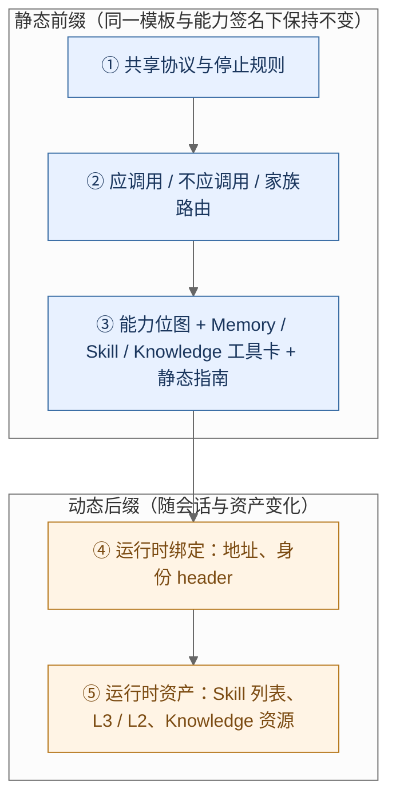
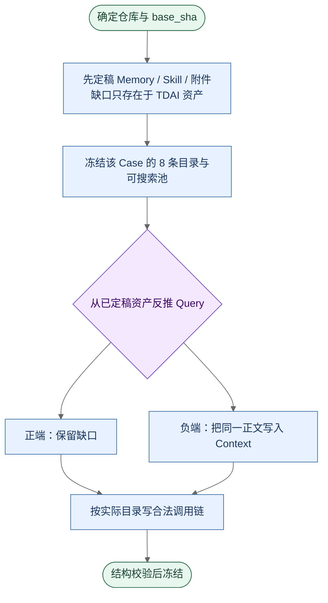
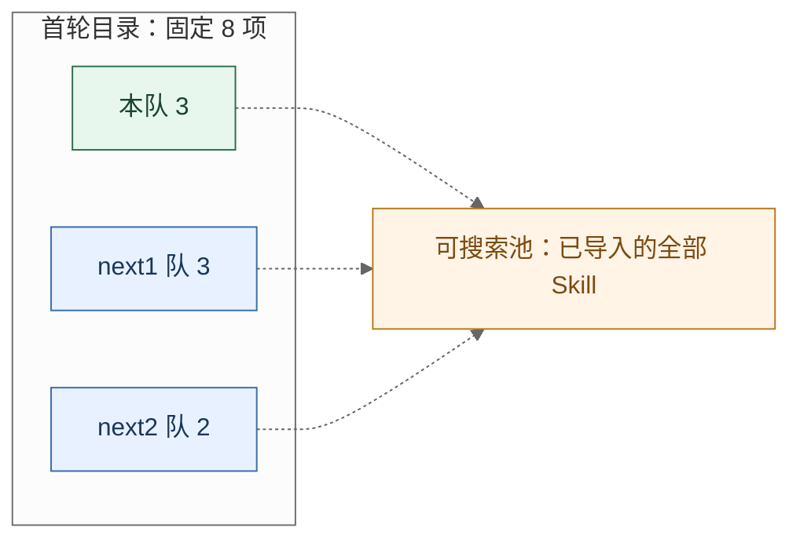
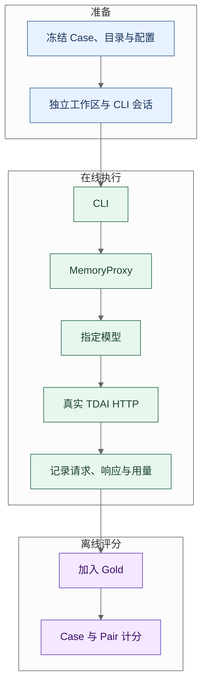

# 任务一：Proxy 系统提示词注入优化报告（旧版）

> 实验数字来自既有对照运行。

TencentDB Agent Memory
2026 年 9 月 9 日

## 摘要

MemoryProxy 向模型注入 Memory、Skill、Knowledge 的工具说明。baseline 将这些说明写在分散的 injector 中：调用条件、HTTP 协议与会话资产混在同一段散文里，三个家族重复描述同一套 curl 与错误处理，触发规则以「主题相关则必须调用」为主，缺少可执行的否定边界。本工作将注入过程重构为生成链——运行时契约、提示词中间表示（Prompt IR）、差异化工具卡、统一注入区——使模型先判断当前输入是否缺少持久化事实或团队工作流，再决定是否调用；需要调用时依据 `when` / `avoid` / `contrast` 选择工具，并沿着真实响应中的 ID、路径与 schema 完成后续步骤；信息已经充分时停止。

评测使用基于公开仓库语境构造的 `test1k` 数据集（39 个仓库、1,140 条 Case），在 Codex CLI（`gpt-5.6-luna`）与 Claude Code CLI（`glm-5.3-flash`）上分别对照 `server_team` 与 `v4-compact`。既有运行记录显示：两个终端上不应调用场景的真实 TDAI 请求明显下降，首工具正确率与完整链成功率上升，工具说明长度约减少 29%；应调用场景的有效调用率有小幅回落。各组有效样本不同，结果按终端独立报告。

## 目录

1. [代码优化与方法设计](#1-代码优化与方法设计)
2. [数据来源与数据集构造](#2-数据来源与数据集构造)
3. [实验设定与结果](#3-实验设定与结果)
4. [交付与后续工作](#4-交付与后续工作)

[附录 A　关键代码依据](#附录-a-关键代码依据)

---

## 1. 代码优化与方法设计

### 1.1 任务边界

注入对象是系统提示词中的工具协议、选择规则、运行时绑定和部分动态资产，不是 Memory 正文或 Skill 附件本身。优化针对四类可观察行为：

1. **应调会调。** 当前输入缺少持久化事实、既有决定或团队工作流时，模型必须发出绑定到执行器的 TDAI HTTP 请求。仅在回复中写出工具名、打印 curl、或使用本地读文件 / 搜索，不计入调用。
2. **不该调则不调。** 普通编码、一般知识，或对话、L3、此前工具结果已经给出所需内容时，不因关键词或主题相似而调用。
3. **选对工具并完成衔接。** 首次动作的家族、工具、端点、方法与操作与 Gold 一致；多步场景将前一步返回的 `skill_id`、`path`、`version` 或参数 schema 传入下一步，而不是由模型凭空构造。
4. **说明更短且前缀稳定。** 三个家族共用一份 HTTP 协议；会话地址、header 与资产列表置于静态规则之后，使同一模板与能力条件下的前缀不随会话抖动。

工具返回的资产是否改善最终代码，不在本任务评分范围内。

### 1.2 baseline 的结构性问题

baseline 并非工具数量过多，而是把三种职责写进同一层散文：**决策**（何时必须查、何时可以不查）、**协议**（如何拼 URL、header、JSON，如何判断成功）、**资产**（当前地址、Skill 列表、L3 / L2、Knowledge 资源）。Memory 块要求「遇到身份、历史、偏好、约定必须先查」；Skill 列表头要求「部分相关也必须加载，宁可多加载」；Knowledge 再单独重复 endpoint、身份 header 与错误处理。模型看到的是一组长说明，而不是可执行的选择结构。

| 结构问题 | 对模型行为的影响 | 改造方向 |
|:---|---|---|
| 调用条件只有正向强制句，缺少否定边界 | 主题相似即检索；答案已在上下文中仍重复调用 | 将应调用、不应调用、家族路由提升为全局门控 |
| HTTP 协议在三个家族中各写一遍 | Token 膨胀；修改一处容易漏掉另外两处 | 抽出共享协议，工具卡只保留差异字段 |
| 工具之间的数据依赖写在散文里 | 模型知道存在 `skill_search`，但不一定把返回的 `skill_id` 传给下一步 | 在 Prompt IR 中显式记录 handoff 与参数来源 |
| 动态资产与静态规则混排 | 会话地址变化导致整段前缀字节变化，不利于 prompt cache | 静态决策规则前置，绑定与资产后置 |
| 工具清单与 Bridge 接口可能漂移 | 提示词中的参数与真实接口不一致 | 集中维护运行时契约，编译后校验声明与输出一致 |

本章对照 `implementations/baseline` 与 `implementations/final` 的注入实现。完整服务目录中的客户端适配、会话与其它模块差异不计入本任务的提示词贡献。需要区分三类性质：接口说明与真实 handler 不一致，属于应修复的错误；积极加载改为信息缺口门控，属于面向本任务的策略调整；压缩过程中保留的既有能力，属于语义保全，不能靠删除真实能力换取更短文本。

#### 1.2.1 跨 Agent 搜索后按名称读取

baseline 允许 `skill_search` 检索团队内其它 Agent 的技能，随后的 view 说明又指示使用搜索结果中的 **name**。Core 的 `handleGetByName` 按当前请求的 `agent_id` 查询名称。搜索的覆盖范围大于按名称读取的作用域：Agent A 搜到 Agent B 发布的技能后，若 A 没有同名技能，按原文调用会得到 `SKILL_NOT_FOUND`；若 A 存在同名但内容不同的技能，则可能读到另一个对象。

final 将「当前 Agent 已知名称」交给 `skill_view`（`/get-by-name`），将搜索命中项的 `data.items[].skill_id` 交给 `skill_view_by_id`（`/get`）。发现与读取通过稳定标识衔接，底层权限校验保持原样。该修改消除了错误的调用指引。

#### 1.2.2 将 curl 落盘参数误当作响应格式开关

baseline 对 `files_read` 的说明称：在 curl 后加 `-o`，Proxy 就会返回原始字节。实际上 `/files/read` 返回 JSON 信封，`-o` 只是把该响应当文件保存；baseline 的 Skill Bridge 已有独立的 `/files/download` 分支用于解码并返回字节。按旧说明保存脚本时，磁盘上可能是 JSON 对象，而不是可执行文本。

final 将 `files_read` 明确为把附件读入上下文（`data.content` / `data.encoding`），需要原始字节落盘时使用 `files_download`。这是修正接口用法，并补上下载入口的模型可见说明，而不是新增后端下载能力。

#### 1.2.3 不作为接口错误计入的项目

| 项目 | 核对结论 | 归类 |
|:---|---|---|
| 部分相关 Skill 必须加载 | baseline 明确采用积极加载 | 改为信息缺口门控，属策略优化 |
| explore / node 与避免重复读源码 | baseline Knowledge 已有相应指引 | compact 中的补强属于明确化 |
| view 后读取附件 | baseline 已描述该流程 | 当前补充精确标识与版本来源 |
| Skill 软删除与异步提取 | baseline 已说明 archive 与异步行为 | 保留语义 |
| scene 的历史 version | 实际 schema 只接收 `path`，handler 读当前文件 | 读取接口不支持按历史 version 取回 |

审查接口时不能停留在生成类型或注释，需要沿路由、参数解析和存储读取确认运行行为。

### 1.3 总体架构：由手写长文改为生成链

final 的注入过程可以表示为：


这条链的意义不只是缩短文本，而是把三类问题拆开，使它们可以分别编写、测试和归失败因：

- **运行时契约** 描述真实 Bridge 支持的方法、路径、参数与能力开关，对应「接口事实」。
- **Prompt IR** 描述调用条件、参数来源、前驱关系、handoff 与恢复规则，对应「决策语义」。IR 是编译内部结构，不是新增的模型工具。
- **编译器与布局** 按当前会话能力生成可见卡片，并按固定顺序装配注入区，对应「渲染与缓存边界」。

因此，若评测中出现 Memory 误调用偏高，应优先检查全局门控与 `when` / `avoid`；若附件路径经常被编造，应检查 handoff 是否被渲染进卡片、以及 view 返回值是否约束了 `files_read`。不必在一段巨型字符串上反复改措辞。

### 1.4 运行时契约

源码：`implementations/final/MemoryProxy/src/injection/tool-prompt/runtime-contract.ts`。每个工具至少包含：

| 字段 | 含义 | 例子 |
|:---|---|---|
| `id` / `family` | 工具身份与家族 | `skill_view_by_id` / `skill` |
| `method` / `path` | HTTP 方法与相对路径 | `POST` / `/skill-bridge/v3/skill/get` |
| `requiredArgs` | 卡片必须给出的参数 | `skill_id`、`path` |
| `optionalArgs` | 过滤或版本等可选参数 | `version`、`include_manifest` |
| `forbiddenArgs` | 禁止猜测或重复传入 | `user_id`、`team_id` 等身份字段 |
| `requiredHeaders` | 调用所需 header，取值来自运行时绑定 | `content-type`、`x-tdai-service-id` |
| `responseKind` | JSON 或原始字节 | Skill 文件下载为 `bytes` |
| `capability` | 能力裁剪依据 | `memory.read`、`skill.read` |
| `sourceRefs` | 对应的 Bridge / schema 来源 | MemoryBridge、MemoryCore schema |

例如：`tdai_memory_search` 只要求 `query`，身份不得写入 body；`skill_files_read` 要求 `skill_id` 与 `path`，path 不得由模型编造；`knowledge_tools_call` 的参数值必须满足前一步 `tools/list` 返回的 schema。契约由人工对照接口维护。当生成 schema、手写覆盖与 handler 不一致时，以真实执行路径为准。

### 1.5 Prompt IR：把选择理由和多步执行写成字段

`prompt-ir.ts` 在契约之上增加模型决策所需的结构：

- `when`：何种信息缺口出现时应调用该工具；
- `avoid`：看似相关但不应走该入口的情况；
- `contrasts`：与相邻工具的分流条件，例如原话走会话检索、目录中的当前 Agent 名称走 `skill_view`、搜索命中走 `skill_view_by_id`；
- `prerequisites`：调用前是否必须先完成发现或查看；
- `handoffs`：前一步输出字段如何绑定到下一步入参，含来源（用户 / 注入资产 / 工具输出）与强度；
- `parameterProvenance`：参数来自用户输入、注入资产还是前一步响应；
- `recovery`：错误或空结果时允许的一次恢复，与 4xx 原样重试分开；
- `produces` / `continueIf`：工具产出什么，以及缺口闭合后即停止。

「先搜索再查看」因此不再是散文建议，而是带 producer、绑定字段和条件强度的 handoff；「结果为空怎么办」被限制为至多一次、且不得猜测替代 ID 或路径。

需要区分 **IR 中的字段** 与 **模型实际看到的字段**。当前渲染器输出 `when`、`avoid`、`contrast`、input hint、handoff 与 recovery，并不把 prerequisites 表或全部 provenance 记录原样打印到提示词。对附件读取，模型可见约束来自 view 的返回值说明、`files_read` 的 input 以及 Skill 静态指南；对 Knowledge，handoff 区分「操作名传递」与「按 schema 构造参数值」。结构化 IR 便于审计和回归比较；最终行为仍取决于发往模型的请求文本。二者需要对照查看。

### 1.6 信息缺口门控

final 用三条全局规则作为所有家族的决策入口，写在 `prompt-layout.ts` 的 `V4_EFFECTIVE_GLOBAL_RULES` 中。

**应调用。** 仅当启用的持久化资产能够提供当前输入中缺失的必要上下文时，才进入调用流程。

- Memory：回答前取回对话与 L3 中没有的用户事实、偏好、既有决定、原话或已知场景正文。L2 给出的路径和摘要不是场景正文。
- Skill：任务明确要求使用某 Skill，或确实依赖一项尚未给出的团队工作流。名称与 description 只是目录，不是流程正文。主题相关或普通编码本身不构成加载理由。
- Knowledge：需要跨文件结构、模块关系或设计理由。当前文件中的精确实现仍以工作区源码为准。

**不应调用。** 任务是自包含的编码或一般知识，不依赖资产中的事实或流程；或者所需内容已经出现在当前对话、L3 或此前工具结果中。关键词重合、工具「看起来可能有帮助」，单独不构成调用理由。

**家族路由。** 依据缺失证据的来源，而不是依据主题词。记住的决定、约定及其理由优先走 Memory；可执行步骤、清单、必需附件优先走 Skill；跨文件结构优先走 Knowledge。同一「约定」可以分属两个家族：历史与理由用 Memory，操作步骤用 Skill。优先级不是互斥所有权——当前家族结果仍缺少必要证据时，再换家族，而不是用仓库名、文件名或技术词直接指定来源。

这把「是否调用」和「调用哪一个工具」分成两个阶段，避免模型在看到某个关键词后直接进入固定家族。

### 1.7 工具卡

`compiler.ts` 调用 `buildPromptIR`，再由 `readable-shared-defaults.ts` 渲染为工具卡。共享协议只出现一次，统一说明：这些能力不是原生函数，需要时用 Shell 执行 curl；只输出工具名不等于执行；POST JSON；endpoint 由家族基路径加卡上相对 `path` 组成；身份只走 Runtime bindings；成功条件为 HTTP 成功且 JSON `code=0`；`response: bytes` 才是原始字节；4xx 不原样重试，瞬时 5xx 最多一次。默认值单独声明一次：省略的 requires / optional / handoff / recovery 视为无；响应默认 JSON。

工具卡只保留相对这份协议的差异。以下按当前 compiler 输出节选：

```text
<tool name="skill_view_by_id">
  when: Open a team result or exact skill_id.
  requires: skill_id
  path: /get
  optional: version,include_content,include_manifest
  input: returns data.skill_id, data.version, data.manifest[].path; content/manifest default true.
  handoff[conditional;user|asset|output]: skill_search.data.items[].skill_id->skill_id; direct only if available
  produces: instructions
  recover-once[bad-id]: skill_search
</tool>
```

JSON 为默认响应类型，因此卡片不重复输出 `response: json`。并非每张卡都有 `avoid` 或 `contrast`。

| 字段 | 保留原因 | 从 baseline 中去掉的重复 |
|:---|---|---|
| `when` | 调用时机，对应缺口门控在单工具上的落点 | 「如果你觉得相关就加载」一类解释 |
| `avoid` / `contrast` | 区分家族内部的相邻入口 | 每个相邻工具再附一份完整 curl |
| `path` / `requires` | 支持真实执行 | 完整 URL、重复的身份 header 示例 |
| `handoff` | 下一步参数必须来自已观察到的字段 | 「请根据上一步结果继续」 |
| 停止与恢复 | 缺口闭合即停；恢复至多一次 | 多份互不一致的错误码长表 |

Token 计量覆盖共享协议、卡片、静态指南和绑定后的地址 / header，不能只比较短卡而忽略新增的共享段。

### 1.8 多步参数衔接

baseline 把多步关系写在使用说明里，模型容易用名称代替 ID、用猜测的附件路径调用 `files_read`，或把 Knowledge 的参数 schema 原样当作调用参数。final 把三类最容易失败的链路写成绑定：

| 链路 | 参数衔接 | 不允许的做法 |
|:---|---|---|
| `skill_search` → `skill_view_by_id` | `data.items[].skill_id` → `skill_id`，版本取同一结果项 | 把 name 当作 ID；混用另一条搜索结果的 ID |
| `skill_view` → `skill_files_read` | 已查看 Skill 的 `skill_id`、`version` 与 `manifest[].path` | 编造附件路径或版本 |
| `knowledge_tools_list` → `knowledge_tools_call` | `data.tools[].name` → `tool_name`；按 `data.tools[].params` 的字段定义构造 **params 的值** | 把 schema 对象直接当作调用参数 |

Memory 侧保留 `tdai_scenario_ls` → `tdai_read_scene` 的 path 传递。若用户输入、注入资产或前一步结果中已经有可靠的名称、ID 或路径，允许直达，不强制先走发现步骤。这样既避免无意义的完整链，也避免「为了保险」重复调用。

恢复与重试分开描述。坏 Skill ID 允许重新搜索一次；坏 path 允许重新查看 manifest；Knowledge schema 无效时回到 `tools/list`；语义检索为空时，仅当缺口仍在且已具备 type / time / session 等过滤条件，才允许一次更精确的查询。4xx 按共享规则不原样重试。空结果、请求失败和「目标确实不存在」不再混用同一套「再试一次」。

以附件任务说明这条链如何被使用。用户要求遵循某项团队流程，而当前 8 条目录只有名称和摘要。模型应先判断流程正文是否缺失，再 `skill_view`；若返回正文指向某份配置模板，且模板不在现有上下文中，则从**同一次** view 的 manifest 取出 path，连同 `skill_id`、`version` 调用 `files_read`。若正文已经足够回答，在 view 后停止；若 Context 已经给出正文和模板，整条链都可以不调用。该过程对应四种独立失败：未识别缺口、选择了错误工具、引用了错误参数、必要步骤完成后仍继续调用。评分将触发、首工具、完整链和过量调用分开，而不是只问「有没有调过 Skill」。

Knowledge 以 explore 作为架构理解、行为解释和代码定位的默认入口，查询可以使用自然语言、符号或文件名。仍缺少单一符号细节时再使用 node，需要源码时指定 `includeCode=true`。search 适用于只要符号位置的情形；callers、callees、impact 用于已有明确目标的关系查询。上述路由仍服从真实 `tools/list` 的描述与参数。对同一资源，工具目录按会话缓存；仅当 schema 错误时才按恢复规则重新发现。索引返回的源码是快照，核对当前工作区或做精确修改时再读本地文件。

| 响应状态 | 判断依据 | 随后动作 |
|:---|---|---|
| 完整且有用 | HTTP 成功、业务码正常，内容足够回答 | 作答并停止 |
| 正常空结果 | 响应成功但目标结果为空 | 不编造；仅当缺口仍在且满足恢复条件时继续 |
| Memory 部分覆盖 | `data.partial=true`，可能含 `data.failed_agents[]` | 说明覆盖不全；部分为空不能证明无记忆 |
| Knowledge 工具失败 | `data.isError=true`，详情在 `data.text` | 即使外层 `code=0` 也按失败处理 |
| 临时服务故障 | 可恢复的 5xx | 至多一次原样重试 |
| 参数或定位错误 | bad-schema / bad-id / bad-path | 按卡片纠正或重新发现 |

Knowledge 的 `get_info` 返回元数据，不适用 code-graph 文本查询的 `data.text` 形状。错误类型既影响模型下一步，也影响评分：发起过错误请求仍计入触发，但不计入首工具正确或完整链成功。

### 1.9 能力裁剪与注入布局

`capability-pruned.ts` 将会话能力表示为 bitmap，例如 `memory`、`skill`、`knowledge`、`wiki`、`code_graph`、`skill_write`、`skill_extract`。编译时只暴露当前真正可用的契约：`skill=0` 时不出现 Skill 读 / 写 / 提取卡；`skill_write=0` 时不出现写操作，但不影响只读；`knowledge=1` 必须至少打开 `wiki` 或 `code_graph`，否则视为能力状态不一致。未启用的家族不会仅仅因为某个 injector 被注册而进入提示词。能力裁剪按会话开关进行，不是根据每条用户 Query 改写前缀。

`prompt-layout.ts` 将各 injector 的产物装配为唯一的 `<task1_prompt_injection>`，顺序固定：



`pipeline.ts` 在装配后执行 `lintCompiledToolPromptBundle` 与 `lintAssembledFidelityInjectionRegion`，检查工具集合、标签边界、家族路由和共享段是否只出现一次。

### 1.10 缓存边界

优化同时处理 Token 数量与 prompt cache 的前缀稳定性。静态前缀在模板版本与能力签名不变时保持字节稳定；动态后缀承载 endpoint、header、Skill listing、L3 / L2 与 Knowledge 资源。`profiles.ts` 将模板版本、能力签名纳入缓存键，避免不同能力或不同资产开关共用同一缓存条目。布局测试验证：仅改变服务地址时，静态前缀不变；宿主原有的 `cache_control` 不被搬动；动态资产不会被当作结构规则写入前缀。

前缀稳定为地址轮换、会话切换或 listing 更新时复用稳定段提供了条件。供应商是否命中缓存还取决于模型、最小缓存长度、有效期和整段请求结构，不能由布局单独保证命中率或账单下降。

### 1.11 实现路径与校验

围绕注入流水线形成可回归的结构：

1. `runtime-contract.ts` 维护接口事实；
2. `prompt-ir.ts` 维护选择、衔接和恢复语义；
3. `compiler.ts` 生成家族卡片；
4. `capability-pruned.ts` 按会话能力裁剪；
5. `prompt-layout.ts` 统一物理布局；
6. `pipeline.ts` 在发往 provider 前做结构 lint；
7. 评测通过 HTTP 采集、Gold 编译和 scorer 对真实行为取证。

提示词实现另有四层检查：契约与能力测试核对声明范围；结构 lint 核对最终工具集合与共享规则；变异测试删除或篡改关键字段并确认检查失败；最终请求快照覆盖真实 injector 装配后的协议与能力组合。最近一次提示词补强通过 7 个测试文件、183 项测试，并更新了对应请求快照。快照是可审阅的输出基准。同一句全局规则会出现在多个能力组合中，快照行数变化不等于新增了同等规模的功能。

当前源码包含对 Knowledge footer、附件读取、Memory 身份与约定措辞及错误处理的补强。第三章沿用既有对照运行的记录；这些补强文字是否已被该轮实验使用，需要由该次运行的源码指纹确认。工具说明在短度与完整性之间存在取舍，下一次实验应同时观察补强带来的 Token 变化与行为变化。

---

## 2. 数据来源与数据集构造

### 2.1 来源层次

正式对照集为仓库冻结的 `test1k`。设计阶段曾有 20 队 × 40 条的 800 条草案，落地后收口为 39 个仓库语境、1,140 条 Case。

| 来源层 | 内容 | 是否进入模型 | 作用 |
|:---|---|:---:|---|
| 工程语境 | DevGPT / NAIST-SE 对话线索、GitHub 仓库、固定 `base_sha` | 是 | 真实代码任务与可恢复工作区 |
| 任务资产 | L1 Memory、Skill 正文、Skill `files[]`、Knowledge | 按层级与目录规则部分可见 | 制造可控信息缺口 |
| 输入快照 | `team.json`、`assets.json`、`cases.jsonl`、Skill catalog、workspace manifest | 经 runner 投影后部分可见 | 冻结身份、资产与可见目录 |
| Gold / Evidence | `gold.jsonl`、`evidence.jsonl`、`case-windows.jsonl` | 否 | 标签、合法链、Pair 与来源追溯 |

公开语境提供真实性，任务资产提供可控缺口，Gold 提供可评分性。目标工具名与 `should_call` 不写入 Prompt；不根据模型表现回改资产。Gold 全部为受控构造（`origin=pilot`），不是 DevGPT 对话的原样回放。DevGPT 记录 revision `685efd2509dede9a6e996b839ae4e20d33430648`，Zenodo `10086809` v9，许可 CC-BY-4.0；各 GitHub 仓库许可独立适用。附件为评测自造内容（MIT-0）。

### 2.2 数据组织

```text
Team + repository / base_sha
  ├─ 资产快照：Memory / Skill / Knowledge
  ├─ 可见 Skill 目录（8 条）+ 可搜索池
  ├─ Case：Query + Context + 工作区引用
  ├─ Gold：should_call、目标、合法序列
  └─ Evidence：来源与改写记录
```

`assets.json` 保存资产正文和附件；`cases.jsonl` 保存模型应看到的消息与 `base_sha`；`gold.jsonl` 保存调用标签与允许的链；`evidence.jsonl` 追溯改写来源。后两者不进入 system / user 消息。

### 2.3 资产先行

构造顺序与「先写问题再匹配工具」相反：



先确定哪些事实只存在于 TDAI 资产、哪些已出现在仓库、L3 或上下文中，再编写 Query。正例的「必须调用」因此有客观来源；负例可以把同一事实放回 Context，而不依赖「这个问题看起来像正例」的主观判断。Team 是数据组织单位（一个仓库与一份共享资产），不表示采集到了真实公司的全部档案。

### 2.4 正负 Pair

一组 Pair 使用相同的最终 Query 字节、相同的 `base_sha`、相同的资产快照和相同的 Skill catalog，只改变前置 Context：

| 对照项 | 应调用端 | 不应调用端 |
|:---|---|---|
| Query / 仓库 / 资产 | 相同 | 相同 |
| Context | 不含目标正文 | 贴入目标正文 |
| Gold | `should_call=true` | `should_call=false` |
| 检验目标 | 缺口识别 | 已知信息时停止 |

标签来自「必要信息是否已经给出」，而不是在 Query 中写「不要调用工具」。正文样例 `DVG-T04-T01-C001` / `C002`：两端询问同一 Unity 项目中 prefab、Tag 与脚本标识应使用的名称，并禁止沿用课程对外标签；正端 Context 只提到有人问起命名，负端直接给出 L1 正文（内部锁定名为 Forest Spirit 与 Evil Spirits）。Gold 分别为 `tdai_memory_search` 与不调用。

正负 Pair 检验的是同一任务在上下文变化后的调用边界；baseline / V4 对照检验的是注入实现变化。两种配对需要同时具备时，才能讨论「实现变化 × 缺口状态」的完整切换。

### 2.5 应调用缺口

`test1k` 应调用构成为 Memory 241、Skill 223、Knowledge 0。Knowledge 资产保留在资产池中，用于能力说明和干扰，不计入正例。

| 缺口类型 | 正例隐藏的内容 | 合法链 |
|:---|---|---|
| Memory | L1 中的持久事实、偏好、约定 | 本集均为 `tdai_memory_search`；conversation / scene 属实现能力，未纳入本集正例 |
| Skill | 未给出的团队流程或附件内容 | `skill_view`；必要时 `skill_search` → `skill_view_by_id` → `skill_files_read` |
| Knowledge | 跨文件结构（本集 CALL 为 0） | `tools/list` 后按 schema `tools/call` |

Skill 目录中的名称和摘要不能代替 Skill 正文；L2 的路径和摘要不能代替场景正文。这一界限决定 Gold 是不调用、单跳还是多跳。

### 2.6 不应调用与干扰

不应调用样本有意保留足够的表面相关性，再要求模型依据证据边界停止。

| 类型 | 构造 | 主要干扰 | 目标 |
|:---|---|---|---|
| 上下文已给 | 将正例缺口正文贴回 Context | 工具与 Query 仍与正端相同 | 判断已有证据是否足够 |
| 同主题干扰 | 仓库已给出 API 或改法，同时出现外队同主题 Skill | 关键词高度相似 | 区分相似与任务依赖 |
| 普通编码 | 当前文件足以完成修改 | 系统中仍有全部工具说明 | 普通编码的误触发 |

目录可见性（目标是否在 8 条 listing 中）和附件是否必需，是 Skill 样本的设计维度，不是额外的不应调用类别，不能加入样本总量。当前不应调用：上下文已给 464、干扰 109、普通编码 103。

干扰资产包括同主题外队 Skill、其它合法 Memory / Knowledge、仓库中的表面关键词以及可见目录。它们不是脏数据，而是用来检验模型是否把「可见」当成「必须调用」。例如，仓库已经给出某 API 的精确用法时，即使 listing 里有同主题 Skill，仍应使用本地源码；反之，团队流程确实缺失、listing 只有名称时，必须继续查看正文。

### 2.7 Skill 可见目录与合法链

Skill 最容易同时触发误调用和链路错误，因此采用两层可见性：



目录的选择与顺序由固定 seed、Team、`case_id` 决定，不依据 Gold 或模型结果挑选。同一 Case 在 baseline 与 V4 上接收相同的名称、描述、顺序和资产内容。

| 条件 | Gold 首选链 |
|:---|---|
| 目标出现在 8 条目录中 | `skill_view` |
| 不在 8 条中、仍可搜索 | `skill_search` → `skill_view_by_id` |
| 答案位于附件（独立条件） | 在相应查看步骤之后追加 `skill_files_read` |

`targetVisible` 表示目录是否展示该名称，不表示当前 Agent 对任意外队技能拥有 get-by-name 权限。发现跨 Agent 目标时，应使用搜索响应中的 `skill_id`。

### 2.8 Gold 的使用方式

模型可见：消息、仓库源码、L3 全文、L2 路径与摘要、8 条 Skill 名称与描述、运行时工具说明，以及实际执行后的工具响应。模型不可见：`should_call`、Gold 指定的目标资产与预期序列、Pair 对应关系、出题理由。运行时采集请求、curl、HTTP 与参数绑定；评分在离线阶段将证据投影为触发、首工具、完整链和 Pair 指标。

收口规则包括：`case_id` 唯一且 Pair 可双向对齐；`base_sha`、资产与 catalog 来自同一输入版本；应调用端不出现「not in this chat」等出题人口径；listing 描述从当前 `assets.json` 同步；`files[]` 具有稳定 path。`validate_test1k.py` 输出 `teams=39 keep=1140 overlay=100 unpaired_call=0 bad=0`，覆盖文件结构、窗口与 Pair Query 等检查，不等于逐条语义已经人工审完。

### 2.9 规模与覆盖

| 项目 | 数量 | 说明 |
|:---|---:|---|
| Team / 仓库 | 39 / 39 | 每队对应固定工作区 |
| Case | 1,140 | `test1k` 构造规模 |
| 应调用 / 不应调用 | 464 / 676 | Gold 标签 |
| 正负 Pair | 464 | 同 Query，只改变 Context |
| 应调用构成 | Memory 241；Skill 223；Knowledge 0 | 按答案来源 |
| 不应调用构成 | 已给 464；干扰 109；普通编码 103 | 受控负例 |
| Memory / Skill / 带附件 Skill | 293 / 240 / 39 | 作者资产 |
| Knowledge 资源 | 78 | 能力与干扰，无正向 Gold |

按 `keep-case-ids.jsonl` 与 `case-windows.jsonl` 统计的正式链型：

| 链型 | Case | 含义 |
|:---|---:|---|
| `tdai_memory_search` | 241 | L1 缺口 |
| `skill_view` | 66 | 目录内已知名称 |
| `skill_search` → `skill_view_by_id` | 118 | 目标不在当前 listing |
| `skill_view` → `skill_files_read` | 31 | 可见技能的附件缺口 |
| 搜索 → 按 ID 查看 → 读附件 | 8 | 先发现再读附件 |
| 不调用 | 676 | 已给 / 干扰 / 普通编码 |

附件正例合计 39 条，其中两跳与三跳如上。本集 Memory 正例不覆盖 conversation 与 scene；Knowledge 无正例；写入与生命周期不由这组读取任务检验。接口入口存在与评测正例覆盖是不同事实。

公开仓库提供工程语境，TDAI 资产、缺口和 Gold 是本任务构造的受控元素。Pair 负端将答案直接写入 Context，可能比自然对话中的隐含信息更容易识别。该数据适用于检验缺口门控与参数链；生产环境中的误调用率还受多来源部分覆盖、资产更新和更长对话历史影响。

---

## 3. 实验设定与结果

### 3.1 实验问题

实验比较的是指定终端与模型下，两份服务快照在工具调用行为上的差异，关注三个问题：

1. 将强制触发改为信息缺口门控之后，不应调用场景的误调用是否下降；
2. 将工具说明改为契约化卡片之后，首工具选择与多步链路是否更稳定；
3. 合并重复协议并稳定静态前缀之后，工具说明是否缩短，同时应调用场景仍能触发。

### 3.2 对照与执行

| 项目 | baseline | V4 |
|:---|---|---|
| 服务配置 | `server_team` / `legacy` | `V4` / `v4-compact` |
| 注入 | 各 injector 分别拼接长工具块 | 契约 + IR + 编译 + 统一布局 |
| Case、Query、`base_sha`、资产、目录、能力开关 | 相同 | 相同 |

每个 Case 使用独立 CLI 会话与按 `base_sha` 检出的工作区。两侧服务独立部署。结果按终端分开，不合并为总准确率。baseline 与 V4 的产品目录还存在提示词以外的差异，解释为服务版本对照。

| 终端 | 模型 |
|:---|---|
| Codex CLI | `gpt-5.6-luna` |
| Claude Code CLI | `glm-5.3-flash` |



执行器不根据 Gold 提示或提前停止。计数单位是进入并绑定到执行器的 TDAI 尝试；Proxy 向 Core 的多路请求仍属同一次尝试。基础设施失败另行记录，不记为「不应调用」。重试仅限基础设施原因，保留全部 attempt。

### 3.3 指标

记 P 为应调用且证据完整的 Case，N 为不应调用且证据完整的 Case，T 为 P 中实际发出 TDAI 请求的子集。各组使用该组自己的有效样本作分母。证据不完整时，缺失日志不能解释为正确的不调用。

| 指标 | 定义 | 方向 |
|:---|---|:---:|
| 有效调用率 | T / P，选错家族也计入触发 | ↑ |
| 误调用率 | N 中发生 TDAI 请求的比例 | ↓ |
| 首工具正确率 | 首次绑定动作的家族、工具、端点、方法、操作与 Gold 首步一致的正例占 P；漏调用留在分母 | ↑ |
| 调用后首工具正确率 | 上述分子除以 T | ↑ |
| 完整链成功率 | 完成合法链，且必要参数与真实响应绑定满足 Gold，占 P | ↑ |
| 严格链成功率 | 完整链成功，且观察窗口内没有最短链之外的动作 | ↑ |
| 过度调用率 | 正例中出现超出 Gold 所需范围的额外调用 | ↓ |
| 工具说明长度 | 首次任务请求中完整工具说明的 `o200k_base` Token。计入共享协议、卡片、指南及绑定后的地址与 header；不计入 Skill 条目正文、用户消息与供应商包装 | ↓ |

同一集合下，首工具正确率等于有效调用率乘以调用后首工具正确率。只报告条件准确率会掩盖漏调用。工具说明长度对整段提取文本编码一次；它不等于供应商账单输入，也不等于纯静态缓存前缀。Token 对照使用双方均有计量的同 Case 子集，该子集不必与行为指标分母相同。

### 3.4 结果

结果取自既有对照运行。撰写本稿时未重新执行模型。Codex V4 的触发正例为 69，调用后首工具正确率按 32/69 计算。baseline 与 V4 的有效 Case 数不同，表内变化为各组描述性差值。

#### 样本覆盖

| 终端 / 版本 | 有效 Case | 应调用 | 触发正例 | 不应调用 | 同 Case Token 对照 |
|:---|---:|---:|---:|---:|---:|
| Codex baseline | 261 | 111 | 106 | 150 | 162 |
| Codex V4 | 180 | 75 | 69 | 105 | 162 |
| Claude baseline | 188 | 75 | 71 | 113 | 125 |
| Claude V4 | 139 | 53 | 49 | 86 | 125 |

#### Codex CLI · `gpt-5.6-luna`

| 指标 | baseline | V4 | 变化 |
|:---|---:|---:|---:|
| 有效调用率 ↑ | 95.50%（106/111） | 92.00%（69/75） | −3.50 个百分点 |
| 误调用率 ↓ | 90.00%（135/150） | **31.43%（33/105）** | **−58.57 个百分点** |
| 首工具正确率 ↑ | 26.13%（29/111） | 42.67%（32/75） | +16.54 个百分点 |
| 调用后首工具正确率 ↑ | 27.36%（29/106） | **46.38%（32/69）** | +19.02 个百分点 |
| 完整链成功率 ↑ | 23.42%（26/111） | 41.33%（31/75） | +17.91 个百分点 |
| 严格链成功率 ↑ | 15.32%（17/111） | 17.33%（13/75） | +2.02 个百分点 |
| 过度调用率 ↓ | 80.18%（89/111） | 58.67%（44/75） | −21.51 个百分点 |

| 工具说明 Token | baseline | V4 | 变化 |
|:---|---:|---:|---:|
| 均值 | 3517.8 | 2475.5 | −1042.3 |
| 中位数 | 3517.0 | 2475.0 | −1042.0 |
| P95 | 3532.0 | 2481.0 | −1051.0 |
| 同 Case 压缩率（n = 162） | 3518.6 | 2475.4 | **29.65%** |

#### Claude Code CLI · `glm-5.3-flash`

| 指标 | baseline | V4 | 变化 |
|:---|---:|---:|---:|
| 有效调用率 ↑ | 94.67%（71/75） | 92.45%（49/53） | −2.21 个百分点 |
| 误调用率 ↓ | 64.60%（73/113） | **16.28%（14/86）** | **−48.32 个百分点** |
| 首工具正确率 ↑ | 44.00%（33/75） | 62.26%（33/53） | +18.26 个百分点 |
| 调用后首工具正确率 ↑ | 46.48%（33/71） | **67.35%（33/49）** | +20.87 个百分点 |
| 完整链成功率 ↑ | 37.33%（28/75） | 54.72%（29/53） | +17.38 个百分点 |
| 严格链成功率 ↑ | 25.33%（19/75） | 26.42%（14/53） | +1.08 个百分点 |
| 过度调用率 ↓ | 69.33%（52/75） | 66.04%（35/53） | −3.30 个百分点 |

| 工具说明 Token | baseline | V4 | 变化 |
|:---|---:|---:|---:|
| 均值 | 3482.8 | 2463.8 | −1019.0 |
| 中位数 | 3484.0 | 2464.0 | −1020.0 |
| P95 | 3493.0 | 2467.0 | −1026.0 |
| 同 Case 压缩率（n = 125） | 3483.1 | 2463.7 | **29.27%** |

两个终端上，不应调用场景的真实 HTTP 均明显减少，首工具正确率与完整链成功率上升，工具说明约缩短 29%。有效调用率分别回落 3.50 和 2.21 个百分点。调用后首工具正确率与全正例首工具正确率分母不同：Codex V4 前者为 32/69，后者为 32/75。

完整链的升幅大于严格链，表明「完成必要步骤」与「只做必要步骤」并未同步变化。模型可能先选择错误工具再经恢复补齐，或在信息已经足够后继续检索。过度调用率在 Codex 上下降 21.51 个百分点，在 Claude 上仅下降 3.30 个百分点，额外动作的位置（发现前、参数恢复中、答案已充分之后）需要按案例拆分。

有效调用率的回落应当按缺口类型核对：Memory 事实、目录内 Skill、目录外 Skill、附件。门控过严、目录理解错误与执行证据不完整，对应不同的后续修改。

| 观测 | 与实现的对应 | 解释范围 |
|:---|---|---|
| 误调用下降 | 全局不应调用规则、家族路由、`avoid` / `contrast` | 与减少关键词驱动调用的设计一致，仍需错误案例核对 |
| 首工具正确率上升 | 卡片 `when`、`contrast` 与必选参数 | 选择边界更清楚；不蕴含整条链每次严格匹配 |
| 完整链上升 | handoff、参数来源、有限恢复 | 与响应字段衔接的设计一致；仍受 CLI 与上游完整性影响 |
| 工具说明缩短 | 共享协议与稀疏卡片 | 计量对象是工具说明，不是供应商总输入 |
| 有效调用率小幅回落 | 不应调用边界收紧 | 需按缺口类型拆分漏调用 |

若需报告统计显著性或跨 Team 的泛化结论，应在双方证据完整的同 Case 交集上计算差值，并给出按 Team 聚类的区间。

---

## 4. 交付与后续工作

本任务交付三项内容。第一，`v4-compact` 注入实现：运行时契约、Prompt IR、工具卡编译、能力裁剪、固定布局与发送前 lint。第二，`test1k` 数据集：在真实仓库语境上通过资产先行、正负 Pair、Skill 目录可见性和干扰资产构造可评分的调用任务。第三，评测与取证路径：真实 CLI、绑定到执行器的 HTTP 采集、离线 Gold 与分终端指标。

当新的工具或能力位加入时，更新契约与 IR，由编译器生成提示词，再用结构检查和行为评测验证，避免在多个 injector 中各写一份互相漂移的说明。

后续工作包括：在更多模型上完成与构造集对齐的对照；对完整链与严格链之间的差距做错误分类；为 Knowledge、conversation、scene、写入和失败恢复建立独立正例，不使用当前读取型 Gold 的成绩代表这些能力。

---

## 附录 A 关键代码依据

路径相对于提交仓库根目录。生成声明、手写覆盖与真实 handler 需要对照阅读。

| 主题 | 代码 | 结论 |
|:---|---|---|
| Skill 积极加载 | `implementations/baseline/MemoryProxy/src/injection/injectors/skill-injector.ts` | 部分相关即加载，属策略差异 |
| 搜索名称与 `-o` 说明 | `implementations/baseline/MemoryProxy/src/injection/injectors/skill-tools-injector.ts` | 两处与真实接口不一致 |
| 按名称读取的 Agent 作用域 | `implementations/baseline/MemoryCore/src/gateway/skill-handlers.ts` | `handleGetByName` 使用请求中的 `agent_id` |
| 原始字节下载 | `implementations/baseline/MemoryProxy/src/skill/skill-bridge.ts` | `/files/download` 分支已存在 |
| scene 实际参数 | `implementations/baseline/MemoryCore/src/gateway/v2-schemas.ts`、`implementations/baseline/MemoryCore/src/gateway/v2-router.ts` | 只接收 path，读取当前文件 |
| baseline Knowledge 规则 | `implementations/baseline/MemoryProxy/src/injection/injectors/knowledge-tools-injector.ts` | 已有 explore / node 与避免重复读源码 |
| 当前全局规则与布局 | `implementations/final/MemoryProxy/src/injection/tool-prompt/compiler.ts`、`implementations/final/MemoryProxy/src/injection/tool-prompt/prompt-layout.ts` | 缺口门控、共享协议、固定顺序 |
| 附件参数来源 | `implementations/final/MemoryProxy/src/injection/tool-prompt/execution-hints.ts` | view 返回值约束 `files_read` |
| IR 与渲染投影 | `implementations/final/MemoryProxy/src/injection/tool-prompt/prompt-ir.ts`、`implementations/final/MemoryProxy/src/injection/tool-prompt/readable-shared-defaults.ts` | prerequisites 不直接写入提示词 |
| Knowledge 运行语义 | `implementations/final/MemoryKnowledge/src/routes/tools.ts` | node 的源码开关、`get_info` 形状、错误状态 |
| 评分准入 | `evaluation/MemoryProxy/eval/tool-prompt-bench/measurement-v2/task1-behavior-report.ts` | 有效分母、触发分子与证据完整性 |
